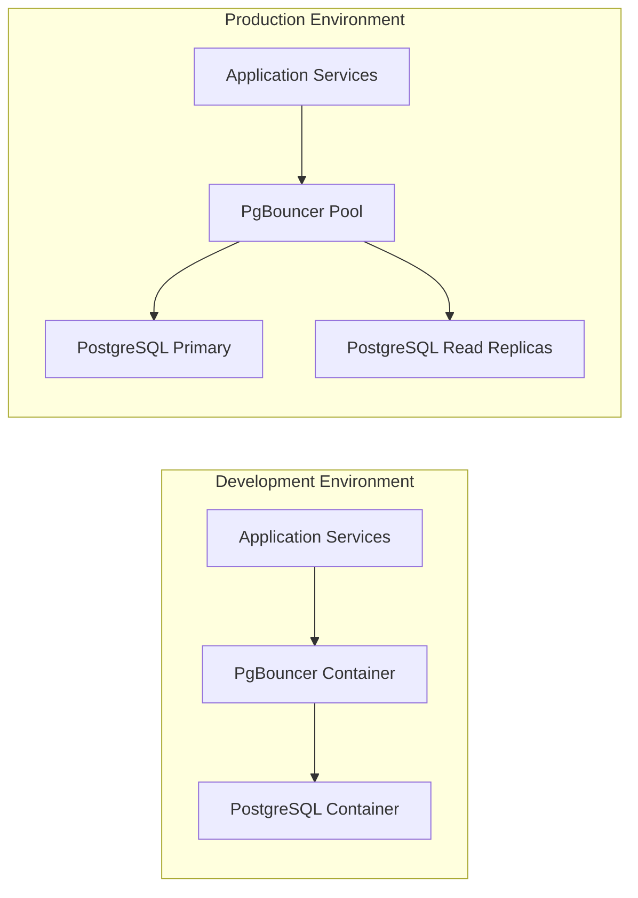
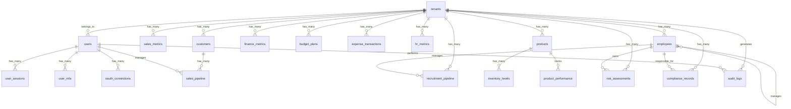

# Database Schema

_Last updated: September 16, 2025_

## Table of Contents

- [Overview](#overview)
- [Architecture Design](#architecture-design)
- [Database Standards & Conventions](#database-standards--conventions)
- [Core Schema Structure](#core-schema-structure)
- [Entity Relationship Overview](#entity-relationship-overview)
- [Database Services Configuration](#database-services-configuration)
- [Docker Integration](#docker-integration)
- [Performance Optimization](#performance-optimization)
- [Security & Compliance](#security--compliance)
- [Migration Strategy](#migration-strategy)
- [Monitoring & Maintenance](#monitoring--maintenance)

---

## Overview

The A-EMS (AI-Driven Enterprise Management System) database schema is designed to support a comprehensive microservices architecture that powers an intelligent business management platform. This schema provides the foundation for executive dashboards, AI-driven analytics, and enterprise-wide business intelligence.

### Key Design Objectives

- **Microservices Support**: Database design optimized for service-oriented architecture with clear domain boundaries
- **AI Integration**: Schema structure that facilitates AI model training and real-time analytics
- **Docker-Native**: Fully containerized database deployment with development-to-production consistency
- **Scalability**: Horizontal and vertical scaling capabilities with performance optimization
- **Data Integrity**: Comprehensive referential integrity with audit trails and compliance support
- **Security**: Enterprise-grade security with role-based access control and data encryption

### Database Technology Stack

- **Primary Database**: PostgreSQL 15+ (containerized)
- **Character Encoding**: UTF-8 (full Unicode support)
- **Collation**: en_US.UTF-8 (international compatibility)
- **Connection Pooling**: PgBouncer (containerized)
- **Backup Strategy**: pg_dump with Docker volumes
- **Monitoring**: PostgreSQL Exporter for Prometheus

---

## Architecture Design

### Microservices Database Patterns

The database architecture follows a **Database-per-Service** pattern with shared core entities for cross-service data consistency:

```mermaid
graph TB
    subgraph "Shared Core Database"
        A[tenants]
        B[users]
        C[user_sessions]
        D[user_mfa]
        E[oauth_connections]
    end

    subgraph "Sales Service Database"
        F[sales_metrics]
        G[customers]
        H[sales_pipeline]
    end

    subgraph "Finance Service Database"
        I[finance_metrics]
        J[budget_plans]
        K[expense_transactions]
    end

    subgraph "HR Service Database"
        L[hr_metrics]
        M[employees]
        N[recruitment_pipeline]
    end

    subgraph "Products Service Database"
        O[products]
        P[inventory_levels]
        Q[product_performance]
    end

    subgraph "Risk Service Database"
        R[risk_assessments]
        S[compliance_records]
        T[audit_logs]
    end

    B --> F
    B --> I
    B --> L
    A --> F
    A --> I
    A --> L
    A --> O
    A --> R
```



### Database Deployment Architecture



---

## Database Standards & Conventions

### Naming Conventions

| Element          | Convention                    | Example                                     |
| ---------------- | ----------------------------- | ------------------------------------------- |
| **Tables**       | snake_case, plural            | `sales_metrics`, `user_sessions`            |
| **Columns**      | snake_case, descriptive       | `created_at`, `customer_acquisition_cost`   |
| **Primary Keys** | `id` (UUID)                   | `f47ac10b-58cc-4372-a567-0e02b2c3d479`      |
| **Foreign Keys** | `{table}_id`                  | `customer_id`, `tenant_id`                  |
| **Indexes**      | `idx_{table}_{column(s)}`     | `idx_users_email`, `idx_sales_metrics_date` |
| **Constraints**  | `chk_{table}_{column}_{rule}` | `chk_users_status_valid`                    |

### Standard Data Types

```sql
-- Universal Unique Identifiers
id UUID PRIMARY KEY DEFAULT gen_random_uuid(),

-- Timestamps (always with timezone)
created_at TIMESTAMP WITH TIME ZONE DEFAULT CURRENT_TIMESTAMP NOT NULL,
updated_at TIMESTAMP WITH TIME ZONE DEFAULT CURRENT_TIMESTAMP NOT NULL,

-- Currency (15 digits, 2 decimal places)
amount DECIMAL(15,2) NOT NULL,

-- Percentages (0-100, 2 decimal places)
percentage DECIMAL(5,2) CHECK (percentage >= 0 AND percentage <= 100),

-- Email validation
email VARCHAR(255) CHECK (email ~* '^[A-Za-z0-9._%+-]+@[A-Za-z0-9.-]+\.[A-Za-z]{2,}$'),

-- Phone (international format)
phone VARCHAR(20) CHECK (phone ~* '^\+[1-9]\d{1,14}$'),

-- Status enumerations
status VARCHAR(50) NOT NULL DEFAULT 'active',

-- JSON data (structured)
metadata JSONB DEFAULT '{}' NOT NULL
```

### Audit Trail Standard

Every business-critical table includes these audit fields:

```sql
-- Audit Fields Template
created_at TIMESTAMP WITH TIME ZONE DEFAULT CURRENT_TIMESTAMP NOT NULL,
updated_at TIMESTAMP WITH TIME ZONE DEFAULT CURRENT_TIMESTAMP NOT NULL,
created_by UUID NOT NULL REFERENCES users(id),
updated_by UUID NOT NULL REFERENCES users(id),
deleted_at TIMESTAMP WITH TIME ZONE DEFAULT NULL  -- Soft delete
```

---

## Core Schema Structure

### 1. Tenant & Multi-Tenancy

```sql
CREATE TABLE tenants (
    id UUID PRIMARY KEY DEFAULT gen_random_uuid(),
    name VARCHAR(255) NOT NULL UNIQUE,
    slug VARCHAR(100) NOT NULL UNIQUE,
    settings JSONB NOT NULL DEFAULT '{}',
    subscription_plan VARCHAR(50) NOT NULL DEFAULT 'enterprise'
        CHECK (subscription_plan IN ('basic', 'professional', 'enterprise')),
    status VARCHAR(20) NOT NULL DEFAULT 'active'
        CHECK (status IN ('active', 'inactive', 'suspended')),
    created_at TIMESTAMP WITH TIME ZONE DEFAULT CURRENT_TIMESTAMP NOT NULL,
    updated_at TIMESTAMP WITH TIME ZONE DEFAULT CURRENT_TIMESTAMP NOT NULL
);

-- Indexes for performance
CREATE INDEX idx_tenants_slug ON tenants(slug);
CREATE INDEX idx_tenants_status ON tenants(status);
```

### 2. Authentication & Security Schema

```sql
-- Core Users Table
CREATE TABLE users (
    id UUID PRIMARY KEY DEFAULT gen_random_uuid(),
    tenant_id UUID NOT NULL REFERENCES tenants(id) ON DELETE CASCADE,
    email VARCHAR(255) NOT NULL UNIQUE
        CHECK (email ~* '^[A-Za-z0-9._%+-]+@[A-Za-z0-9.-]+\.[A-Za-z]{2,}$'),
    username VARCHAR(100) UNIQUE,
    password_hash VARCHAR(255) NOT NULL,
    first_name VARCHAR(100) NOT NULL,
    last_name VARCHAR(100) NOT NULL,
    role VARCHAR(50) NOT NULL DEFAULT 'user'
        CHECK (role IN ('admin', 'manager', 'user', 'viewer')),
    status VARCHAR(20) NOT NULL DEFAULT 'active'
        CHECK (status IN ('active', 'inactive', 'suspended', 'pending')),
    email_verified BOOLEAN NOT NULL DEFAULT FALSE,
    last_login TIMESTAMP WITH TIME ZONE,
    failed_login_attempts INTEGER NOT NULL DEFAULT 0 CHECK (failed_login_attempts >= 0),
    locked_until TIMESTAMP WITH TIME ZONE,
    created_at TIMESTAMP WITH TIME ZONE DEFAULT CURRENT_TIMESTAMP NOT NULL,
    updated_at TIMESTAMP WITH TIME ZONE DEFAULT CURRENT_TIMESTAMP NOT NULL,
    deleted_at TIMESTAMP WITH TIME ZONE
);

-- Session Management
CREATE TABLE user_sessions (
    id UUID PRIMARY KEY DEFAULT gen_random_uuid(),
    user_id UUID NOT NULL REFERENCES users(id) ON DELETE CASCADE,
    token_hash VARCHAR(255) NOT NULL UNIQUE,
    refresh_token_hash VARCHAR(255) UNIQUE,
    device_info JSONB,
    ip_address INET NOT NULL,
    user_agent TEXT,
    expires_at TIMESTAMP WITH TIME ZONE NOT NULL,
    last_activity TIMESTAMP WITH TIME ZONE DEFAULT CURRENT_TIMESTAMP NOT NULL,
    status VARCHAR(20) NOT NULL DEFAULT 'active'
        CHECK (status IN ('active', 'expired', 'revoked')),
    created_at TIMESTAMP WITH TIME ZONE DEFAULT CURRENT_TIMESTAMP NOT NULL,
    CONSTRAINT chk_expires_after_created CHECK (expires_at > created_at)
);

-- Multi-Factor Authentication
CREATE TABLE user_mfa (
    id UUID PRIMARY KEY DEFAULT gen_random_uuid(),
    user_id UUID NOT NULL REFERENCES users(id) ON DELETE CASCADE,
    mfa_type VARCHAR(20) NOT NULL CHECK (mfa_type IN ('totp', 'sms', 'email')),
    is_enabled BOOLEAN NOT NULL DEFAULT FALSE,
    secret_key VARCHAR(255), -- Encrypted TOTP secret
    backup_codes TEXT[], -- Array of encrypted backup codes
    last_used TIMESTAMP WITH TIME ZONE,
    created_at TIMESTAMP WITH TIME ZONE DEFAULT CURRENT_TIMESTAMP NOT NULL,
    updated_at TIMESTAMP WITH TIME ZONE DEFAULT CURRENT_TIMESTAMP NOT NULL,
    UNIQUE(user_id, mfa_type)
);

-- OAuth Connections
CREATE TABLE oauth_connections (
    id UUID PRIMARY KEY DEFAULT gen_random_uuid(),
    user_id UUID NOT NULL REFERENCES users(id) ON DELETE CASCADE,
    provider VARCHAR(50) NOT NULL CHECK (provider IN ('google', 'microsoft', 'linkedin')),
    provider_user_id VARCHAR(255) NOT NULL,
    provider_email VARCHAR(255),
    access_token TEXT, -- Encrypted
    refresh_token TEXT, -- Encrypted
    token_expires_at TIMESTAMP WITH TIME ZONE,
    provider_data JSONB,
    status VARCHAR(20) NOT NULL DEFAULT 'active'
        CHECK (status IN ('active', 'inactive', 'revoked')),
    created_at TIMESTAMP WITH TIME ZONE DEFAULT CURRENT_TIMESTAMP NOT NULL,
    updated_at TIMESTAMP WITH TIME ZONE DEFAULT CURRENT_TIMESTAMP NOT NULL,
    UNIQUE(provider, provider_user_id)
);
```

### 3. Business Domain Schemas

#### Sales Domain

```sql
-- Sales Metrics & KPIs
CREATE TABLE sales_metrics (
    id UUID PRIMARY KEY DEFAULT gen_random_uuid(),
    tenant_id UUID NOT NULL REFERENCES tenants(id) ON DELETE CASCADE,
    metric_date DATE NOT NULL,
    period_type VARCHAR(20) NOT NULL
        CHECK (period_type IN ('daily', 'weekly', 'monthly', 'quarterly', 'yearly')),
    total_revenue DECIMAL(15,2) NOT NULL DEFAULT 0,
    pipeline_value DECIMAL(15,2) NOT NULL DEFAULT 0,
    deals_closed INTEGER NOT NULL DEFAULT 0,
    deals_lost INTEGER NOT NULL DEFAULT 0,
    win_rate DECIMAL(5,2) NOT NULL DEFAULT 0
        CHECK (win_rate >= 0 AND win_rate <= 100),
    customer_acquisition_cost DECIMAL(10,2) NOT NULL DEFAULT 0,
    customer_lifetime_value DECIMAL(10,2) NOT NULL DEFAULT 0,
    churn_rate DECIMAL(5,2) NOT NULL DEFAULT 0
        CHECK (churn_rate >= 0 AND churn_rate <= 100),
    created_at TIMESTAMP WITH TIME ZONE DEFAULT CURRENT_TIMESTAMP NOT NULL,
    updated_at TIMESTAMP WITH TIME ZONE DEFAULT CURRENT_TIMESTAMP NOT NULL,
    created_by UUID NOT NULL REFERENCES users(id),
    updated_by UUID NOT NULL REFERENCES users(id),
    UNIQUE(tenant_id, metric_date, period_type)
);

-- Customer Management
CREATE TABLE customers (
    id UUID PRIMARY KEY DEFAULT gen_random_uuid(),
    tenant_id UUID NOT NULL REFERENCES tenants(id) ON DELETE CASCADE,
    company_name VARCHAR(255) NOT NULL,
    contact_email VARCHAR(255) NOT NULL
        CHECK (contact_email ~* '^[A-Za-z0-9._%+-]+@[A-Za-z0-9.-]+\.[A-Za-z]{2,}$'),
    contact_phone VARCHAR(20)
        CHECK (contact_phone ~* '^\+[1-9]\d{1,14}$'),
    industry VARCHAR(100),
    company_size VARCHAR(50) CHECK (company_size IN ('1-10', '11-50', '51-200', '201-1000', '1000+')),
    territory VARCHAR(100),
    customer_segment VARCHAR(50) NOT NULL
        CHECK (customer_segment IN ('enterprise', 'mid_market', 'smb', 'startup')),
    acquisition_date DATE NOT NULL,
    lifetime_value DECIMAL(15,2) NOT NULL DEFAULT 0,
    total_revenue DECIMAL(15,2) NOT NULL DEFAULT 0,
    last_purchase_date DATE,
    status VARCHAR(20) NOT NULL DEFAULT 'active'
        CHECK (status IN ('active', 'inactive', 'churned', 'prospect')),
    billing_address JSONB,
    custom_fields JSONB DEFAULT '{}',
    created_at TIMESTAMP WITH TIME ZONE DEFAULT CURRENT_TIMESTAMP NOT NULL,
    updated_at TIMESTAMP WITH TIME ZONE DEFAULT CURRENT_TIMESTAMP NOT NULL,
    created_by UUID NOT NULL REFERENCES users(id),
    updated_by UUID NOT NULL REFERENCES users(id),
    deleted_at TIMESTAMP WITH TIME ZONE
);

-- Sales Pipeline
CREATE TABLE sales_pipeline (
    id UUID PRIMARY KEY DEFAULT gen_random_uuid(),
    tenant_id UUID NOT NULL REFERENCES tenants(id) ON DELETE CASCADE,
    customer_id UUID NOT NULL REFERENCES customers(id),
    opportunity_name VARCHAR(255) NOT NULL,
    stage VARCHAR(50) NOT NULL
        CHECK (stage IN ('lead', 'qualified', 'proposal', 'negotiation', 'closed_won', 'closed_lost')),
    value DECIMAL(15,2) NOT NULL CHECK (value > 0),
    probability DECIMAL(5,2) NOT NULL CHECK (probability >= 0 AND probability <= 100),
    expected_close_date DATE NOT NULL,
    actual_close_date DATE,
    sales_rep UUID NOT NULL REFERENCES users(id),
    source VARCHAR(100),
    status VARCHAR(20) NOT NULL DEFAULT 'open'
        CHECK (status IN ('open', 'closed_won', 'closed_lost', 'on_hold')),
    notes TEXT,
    created_at TIMESTAMP WITH TIME ZONE DEFAULT CURRENT_TIMESTAMP NOT NULL,
    updated_at TIMESTAMP WITH TIME ZONE DEFAULT CURRENT_TIMESTAMP NOT NULL,
    created_by UUID NOT NULL REFERENCES users(id),
    updated_by UUID NOT NULL REFERENCES users(id)
);
```

#### Finance Domain

```sql
-- Financial Metrics & KPIs
CREATE TABLE finance_metrics (
    id UUID PRIMARY KEY DEFAULT gen_random_uuid(),
    tenant_id UUID NOT NULL REFERENCES tenants(id) ON DELETE CASCADE,
    metric_date DATE NOT NULL,
    period_type VARCHAR(20) NOT NULL
        CHECK (period_type IN ('daily', 'weekly', 'monthly', 'quarterly', 'yearly')),
    total_revenue DECIMAL(15,2) NOT NULL DEFAULT 0,
    total_expenses DECIMAL(15,2) NOT NULL DEFAULT 0,
    gross_profit DECIMAL(15,2) NOT NULL DEFAULT 0,
    net_profit DECIMAL(15,2) NOT NULL DEFAULT 0,
    ebitda DECIMAL(15,2) NOT NULL DEFAULT 0,
    gross_margin DECIMAL(5,2) NOT NULL DEFAULT 0,
    net_margin DECIMAL(5,2) NOT NULL DEFAULT 0,
    cash_flow DECIMAL(15,2) NOT NULL DEFAULT 0,
    accounts_receivable DECIMAL(15,2) NOT NULL DEFAULT 0,
    accounts_payable DECIMAL(15,2) NOT NULL DEFAULT 0,
    cash_balance DECIMAL(15,2) NOT NULL DEFAULT 0,
    burn_rate DECIMAL(15,2) NOT NULL DEFAULT 0,
    runway_months DECIMAL(5,1) NOT NULL DEFAULT 0,
    created_at TIMESTAMP WITH TIME ZONE DEFAULT CURRENT_TIMESTAMP NOT NULL,
    updated_at TIMESTAMP WITH TIME ZONE DEFAULT CURRENT_TIMESTAMP NOT NULL,
    created_by UUID NOT NULL REFERENCES users(id),
    updated_by UUID NOT NULL REFERENCES users(id),
    UNIQUE(tenant_id, metric_date, period_type)
);

-- Budget Planning
CREATE TABLE budget_plans (
    id UUID PRIMARY KEY DEFAULT gen_random_uuid(),
    tenant_id UUID NOT NULL REFERENCES tenants(id) ON DELETE CASCADE,
    name VARCHAR(255) NOT NULL,
    fiscal_year INTEGER NOT NULL,
    department VARCHAR(100) NOT NULL,
    category VARCHAR(100) NOT NULL,
    planned_amount DECIMAL(15,2) NOT NULL CHECK (planned_amount > 0),
    actual_amount DECIMAL(15,2) NOT NULL DEFAULT 0,
    variance DECIMAL(15,2) NOT NULL DEFAULT 0,
    variance_percentage DECIMAL(5,2) NOT NULL DEFAULT 0,
    period_start DATE NOT NULL,
    period_end DATE NOT NULL CHECK (period_end > period_start),
    status VARCHAR(20) NOT NULL DEFAULT 'active'
        CHECK (status IN ('active', 'locked', 'archived')),
    notes TEXT,
    created_at TIMESTAMP WITH TIME ZONE DEFAULT CURRENT_TIMESTAMP NOT NULL,
    updated_at TIMESTAMP WITH TIME ZONE DEFAULT CURRENT_TIMESTAMP NOT NULL,
    created_by UUID NOT NULL REFERENCES users(id),
    updated_by UUID NOT NULL REFERENCES users(id)
);

-- Expense Transactions
CREATE TABLE expense_transactions (
    id UUID PRIMARY KEY DEFAULT gen_random_uuid(),
    tenant_id UUID NOT NULL REFERENCES tenants(id) ON DELETE CASCADE,
    transaction_date DATE NOT NULL,
    amount DECIMAL(15,2) NOT NULL CHECK (amount > 0),
    currency VARCHAR(3) NOT NULL DEFAULT 'USD' CHECK (currency ~ '^[A-Z]{3}$'),
    category VARCHAR(100) NOT NULL,
    subcategory VARCHAR(100),
    vendor VARCHAR(255) NOT NULL,
    description TEXT NOT NULL,
    department VARCHAR(100),
    employee_id UUID REFERENCES users(id),
    receipt_url VARCHAR(2048),
    tax_amount DECIMAL(15,2) NOT NULL DEFAULT 0,
    is_reimbursable BOOLEAN NOT NULL DEFAULT FALSE,
    approval_status VARCHAR(20) NOT NULL DEFAULT 'pending'
        CHECK (approval_status IN ('pending', 'approved', 'rejected', 'cancelled')),
    approved_by UUID REFERENCES users(id),
    approved_at TIMESTAMP WITH TIME ZONE,
    created_at TIMESTAMP WITH TIME ZONE DEFAULT CURRENT_TIMESTAMP NOT NULL,
    updated_at TIMESTAMP WITH TIME ZONE DEFAULT CURRENT_TIMESTAMP NOT NULL,
    created_by UUID NOT NULL REFERENCES users(id),
    updated_by UUID NOT NULL REFERENCES users(id)
);
```

#### HR Domain

```sql
-- HR Metrics & Analytics
CREATE TABLE hr_metrics (
    id UUID PRIMARY KEY DEFAULT gen_random_uuid(),
    tenant_id UUID NOT NULL REFERENCES tenants(id) ON DELETE CASCADE,
    metric_date DATE NOT NULL,
    period_type VARCHAR(20) NOT NULL
        CHECK (period_type IN ('daily', 'weekly', 'monthly', 'quarterly', 'yearly')),
    total_headcount INTEGER NOT NULL DEFAULT 0,
    new_hires INTEGER NOT NULL DEFAULT 0,
    departures INTEGER NOT NULL DEFAULT 0,
    turnover_rate DECIMAL(5,2) NOT NULL DEFAULT 0 CHECK (turnover_rate >= 0),
    open_positions INTEGER NOT NULL DEFAULT 0,
    time_to_hire_avg INTEGER NOT NULL DEFAULT 0,
    employee_satisfaction DECIMAL(3,1) NOT NULL DEFAULT 0
        CHECK (employee_satisfaction >= 0 AND employee_satisfaction <= 10),
    engagement_score DECIMAL(3,1) NOT NULL DEFAULT 0
        CHECK (engagement_score >= 0 AND engagement_score <= 10),
    training_hours INTEGER NOT NULL DEFAULT 0,
    overtime_hours INTEGER NOT NULL DEFAULT 0,
    absenteeism_rate DECIMAL(5,2) NOT NULL DEFAULT 0
        CHECK (absenteeism_rate >= 0 AND absenteeism_rate <= 100),
    created_at TIMESTAMP WITH TIME ZONE DEFAULT CURRENT_TIMESTAMP NOT NULL,
    updated_at TIMESTAMP WITH TIME ZONE DEFAULT CURRENT_TIMESTAMP NOT NULL,
    created_by UUID NOT NULL REFERENCES users(id),
    updated_by UUID NOT NULL REFERENCES users(id),
    UNIQUE(tenant_id, metric_date, period_type)
);

-- Employee Management
CREATE TABLE employees (
    id UUID PRIMARY KEY DEFAULT gen_random_uuid(),
    tenant_id UUID NOT NULL REFERENCES tenants(id) ON DELETE CASCADE,
    user_id UUID REFERENCES users(id),
    employee_id VARCHAR(50) NOT NULL,
    first_name VARCHAR(100) NOT NULL,
    last_name VARCHAR(100) NOT NULL,
    email VARCHAR(255) NOT NULL
        CHECK (email ~* '^[A-Za-z0-9._%+-]+@[A-Za-z0-9.-]+\.[A-Za-z]{2,}$'),
    phone VARCHAR(20) CHECK (phone ~* '^\+[1-9]\d{1,14}$'),
    department VARCHAR(100) NOT NULL,
    job_title VARCHAR(150) NOT NULL,
    manager_id UUID REFERENCES employees(id),
    hire_date DATE NOT NULL,
    employment_type VARCHAR(20) NOT NULL
        CHECK (employment_type IN ('full_time', 'part_time', 'contractor', 'intern')),
    status VARCHAR(20) NOT NULL DEFAULT 'active'
        CHECK (status IN ('active', 'inactive', 'terminated', 'on_leave')),
    salary DECIMAL(12,2), -- Encrypted in application
    salary_currency VARCHAR(3) NOT NULL DEFAULT 'USD',
    location VARCHAR(255),
    remote_work BOOLEAN NOT NULL DEFAULT FALSE,
    performance_rating DECIMAL(3,1) CHECK (performance_rating >= 1 AND performance_rating <= 5),
    last_promotion_date DATE,
    termination_date DATE,
    termination_reason VARCHAR(255),
    created_at TIMESTAMP WITH TIME ZONE DEFAULT CURRENT_TIMESTAMP NOT NULL,
    updated_at TIMESTAMP WITH TIME ZONE DEFAULT CURRENT_TIMESTAMP NOT NULL,
    created_by UUID NOT NULL REFERENCES users(id),
    updated_by UUID NOT NULL REFERENCES users(id),
    deleted_at TIMESTAMP WITH TIME ZONE,
    UNIQUE(tenant_id, employee_id)
);

-- Recruitment Pipeline
CREATE TABLE recruitment_pipeline (
    id UUID PRIMARY KEY DEFAULT gen_random_uuid(),
    tenant_id UUID NOT NULL REFERENCES tenants(id) ON DELETE CASCADE,
    job_title VARCHAR(150) NOT NULL,
    department VARCHAR(100) NOT NULL,
    candidate_name VARCHAR(255) NOT NULL,
    candidate_email VARCHAR(255) NOT NULL
        CHECK (candidate_email ~* '^[A-Za-z0-9._%+-]+@[A-Za-z0-9.-]+\.[A-Za-z]{2,}$'),
    candidate_phone VARCHAR(20) CHECK (candidate_phone ~* '^\+[1-9]\d{1,14}$'),
    stage VARCHAR(50) NOT NULL
        CHECK (stage IN ('applied', 'screening', 'interview', 'reference_check', 'offer', 'hired', 'rejected')),
    source VARCHAR(100),
    recruiter_id UUID NOT NULL REFERENCES users(id),
    hiring_manager_id UUID NOT NULL REFERENCES employees(id),
    resume_url VARCHAR(2048),
    cover_letter_url VARCHAR(2048),
    application_date DATE NOT NULL,
    expected_start_date DATE,
    salary_expectation DECIMAL(12,2),
    status VARCHAR(20) NOT NULL DEFAULT 'active'
        CHECK (status IN ('active', 'hired', 'rejected', 'withdrawn')),
    rejection_reason TEXT,
    notes TEXT,
    created_at TIMESTAMP WITH TIME ZONE DEFAULT CURRENT_TIMESTAMP NOT NULL,
    updated_at TIMESTAMP WITH TIME ZONE DEFAULT CURRENT_TIMESTAMP NOT NULL,
    created_by UUID NOT NULL REFERENCES users(id),
    updated_by UUID NOT NULL REFERENCES users(id)
);
```

#### Products Domain

```sql
-- Product Catalog
CREATE TABLE products (
    id UUID PRIMARY KEY DEFAULT gen_random_uuid(),
    tenant_id UUID NOT NULL REFERENCES tenants(id) ON DELETE CASCADE,
    sku VARCHAR(100) NOT NULL,
    name VARCHAR(255) NOT NULL,
    description TEXT,
    category VARCHAR(100) NOT NULL,
    subcategory VARCHAR(100),
    brand VARCHAR(100),
    unit_cost DECIMAL(10,2) NOT NULL,
    selling_price DECIMAL(10,2) NOT NULL,
    profit_margin DECIMAL(5,2) NOT NULL,
    weight DECIMAL(10,3),
    dimensions JSONB,
    lifecycle_stage VARCHAR(50) NOT NULL
        CHECK (lifecycle_stage IN ('development', 'launch', 'growth', 'maturity', 'decline', 'discontinued')),
    launch_date DATE,
    discontinue_date DATE,
    supplier_info JSONB DEFAULT '{}',
    status VARCHAR(20) NOT NULL DEFAULT 'active'
        CHECK (status IN ('active', 'inactive', 'discontinued', 'out_of_stock')),
    created_at TIMESTAMP WITH TIME ZONE DEFAULT CURRENT_TIMESTAMP NOT NULL,
    updated_at TIMESTAMP WITH TIME ZONE DEFAULT CURRENT_TIMESTAMP NOT NULL,
    created_by UUID NOT NULL REFERENCES users(id),
    updated_by UUID NOT NULL REFERENCES users(id),
    deleted_at TIMESTAMP WITH TIME ZONE,
    UNIQUE(tenant_id, sku),
    CHECK (selling_price > unit_cost)
);

-- Inventory Management
CREATE TABLE inventory_levels (
    id UUID PRIMARY KEY DEFAULT gen_random_uuid(),
    tenant_id UUID NOT NULL REFERENCES tenants(id) ON DELETE CASCADE,
    product_id UUID NOT NULL REFERENCES products(id),
    warehouse_location VARCHAR(100) NOT NULL,
    current_stock INTEGER NOT NULL DEFAULT 0 CHECK (current_stock >= 0),
    reserved_stock INTEGER NOT NULL DEFAULT 0 CHECK (reserved_stock >= 0),
    available_stock INTEGER NOT NULL DEFAULT 0 CHECK (available_stock >= 0),
    reorder_level INTEGER NOT NULL CHECK (reorder_level > 0),
    max_stock_level INTEGER NOT NULL,
    last_restock_date DATE,
    last_stock_take DATE,
    stock_value DECIMAL(15,2) NOT NULL DEFAULT 0,
    turnover_rate DECIMAL(5,2) NOT NULL DEFAULT 0,
    created_at TIMESTAMP WITH TIME ZONE DEFAULT CURRENT_TIMESTAMP NOT NULL,
    updated_at TIMESTAMP WITH TIME ZONE DEFAULT CURRENT_TIMESTAMP NOT NULL,
    created_by UUID NOT NULL REFERENCES users(id),
    updated_by UUID NOT NULL REFERENCES users(id),
    UNIQUE(tenant_id, product_id, warehouse_location),
    CHECK (max_stock_level > reorder_level)
);

-- Product Performance Analytics
CREATE TABLE product_performance (
    id UUID PRIMARY KEY DEFAULT gen_random_uuid(),
    tenant_id UUID NOT NULL REFERENCES tenants(id) ON DELETE CASCADE,
    product_id UUID NOT NULL REFERENCES products(id),
    metric_date DATE NOT NULL,
    period_type VARCHAR(20) NOT NULL
        CHECK (period_type IN ('daily', 'weekly', 'monthly', 'quarterly', 'yearly')),
    units_sold INTEGER NOT NULL DEFAULT 0 CHECK (units_sold >= 0),
    revenue DECIMAL(15,2) NOT NULL DEFAULT 0,
    profit DECIMAL(15,2) NOT NULL DEFAULT 0,
    returns INTEGER NOT NULL DEFAULT 0 CHECK (returns >= 0),
    customer_rating DECIMAL(3,1) CHECK (customer_rating >= 1 AND customer_rating <= 5),
    review_count INTEGER NOT NULL DEFAULT 0,
    price_elasticity DECIMAL(5,4),
    demand_forecast INTEGER,
    created_at TIMESTAMP WITH TIME ZONE DEFAULT CURRENT_TIMESTAMP NOT NULL,
    updated_at TIMESTAMP WITH TIME ZONE DEFAULT CURRENT_TIMESTAMP NOT NULL,
    created_by UUID NOT NULL REFERENCES users(id),
    updated_by UUID NOT NULL REFERENCES users(id),
    UNIQUE(tenant_id, product_id, metric_date, period_type)
);
```

#### Risk & Compliance Domain

```sql
-- Risk Assessment Management
CREATE TABLE risk_assessments (
    id UUID PRIMARY KEY DEFAULT gen_random_uuid(),
    tenant_id UUID NOT NULL REFERENCES tenants(id) ON DELETE CASCADE,
    risk_name VARCHAR(255) NOT NULL,
    risk_category VARCHAR(100) NOT NULL,
    description TEXT NOT NULL,
    likelihood INTEGER NOT NULL CHECK (likelihood >= 1 AND likelihood <= 5),
    impact INTEGER NOT NULL CHECK (impact >= 1 AND impact <= 5),
    risk_score INTEGER NOT NULL CHECK (risk_score >= 1 AND risk_score <= 25),
    risk_level VARCHAR(20) NOT NULL
        CHECK (risk_level IN ('low', 'medium', 'high', 'critical')),
    owner_id UUID NOT NULL REFERENCES employees(id),
    status VARCHAR(20) NOT NULL DEFAULT 'open'
        CHECK (status IN ('open', 'mitigated', 'accepted', 'closed')),
    mitigation_plan TEXT,
    contingency_plan TEXT,
    last_review_date DATE,
    next_review_date DATE NOT NULL,
    created_at TIMESTAMP WITH TIME ZONE DEFAULT CURRENT_TIMESTAMP NOT NULL,
    updated_at TIMESTAMP WITH TIME ZONE DEFAULT CURRENT_TIMESTAMP NOT NULL,
    created_by UUID NOT NULL REFERENCES users(id),
    updated_by UUID NOT NULL REFERENCES users(id)
);

-- Compliance Monitoring
CREATE TABLE compliance_records (
    id UUID PRIMARY KEY DEFAULT gen_random_uuid(),
    tenant_id UUID NOT NULL REFERENCES tenants(id) ON DELETE CASCADE,
    regulation_name VARCHAR(255) NOT NULL,
    compliance_area VARCHAR(100) NOT NULL,
    requirement_description TEXT NOT NULL,
    compliance_status VARCHAR(20) NOT NULL
        CHECK (compliance_status IN ('compliant', 'non_compliant', 'in_progress', 'not_applicable')),
    last_audit_date DATE,
    next_audit_date DATE,
    responsible_party UUID NOT NULL REFERENCES employees(id),
    evidence_documentation TEXT,
    remediation_plan TEXT,
    deadline DATE,
    created_at TIMESTAMP WITH TIME ZONE DEFAULT CURRENT_TIMESTAMP NOT NULL,
    updated_at TIMESTAMP WITH TIME ZONE DEFAULT CURRENT_TIMESTAMP NOT NULL,
    created_by UUID NOT NULL REFERENCES users(id),
    updated_by UUID NOT NULL REFERENCES users(id)
);

-- Comprehensive Audit Logging
CREATE TABLE audit_logs (
    id UUID PRIMARY KEY DEFAULT gen_random_uuid(),
    tenant_id UUID REFERENCES tenants(id) ON DELETE CASCADE,
    user_id UUID REFERENCES users(id) ON DELETE SET NULL,
    action VARCHAR(100) NOT NULL,
    entity_type VARCHAR(100) NOT NULL,
    entity_id UUID,
    old_values JSONB,
    new_values JSONB,
    ip_address INET,
    user_agent TEXT,
    session_id UUID,
    timestamp TIMESTAMP WITH TIME ZONE DEFAULT CURRENT_TIMESTAMP NOT NULL,
    severity VARCHAR(20) NOT NULL DEFAULT 'info'
        CHECK (severity IN ('debug', 'info', 'warning', 'error', 'critical'))
);
```

---

## Entity Relationship Overview

### Core Relationships



### Cross-Service Data Integration

The schema supports cross-service data queries through well-defined foreign key relationships:

- **User Context**: All services reference the core `users` table for authentication and audit trails
- **Tenant Isolation**: All business data is tenant-scoped for multi-tenancy support
- **Employee Integration**: HR employees can be linked to other business entities (sales reps, risk owners, etc.)
- **Customer Journey**: Customer data flows from sales through finance (billing) to risk (creditworthiness)

---

## Database Services Configuration

### PostgreSQL Configuration

```yaml
# docker-compose.yml database service
services:
  postgres:
    image: postgres:15-alpine
    environment:
      POSTGRES_DB: aems_db
      POSTGRES_USER: aems_user
      POSTGRES_PASSWORD: ${DB_PASSWORD}
      POSTGRES_INITDB_ARGS: '--encoding=UTF8 --lc-collate=en_US.UTF-8 --lc-ctype=en_US.UTF-8'
    volumes:
      - postgres_data:/var/lib/postgresql/data
      - ./database/init:/docker-entrypoint-initdb.d/
      - ./database/backup:/backup
    ports:
      - '5432:5432'
    command: >
      postgres
      -c shared_preload_libraries='pg_stat_statements'
      -c pg_stat_statements.track=all
      -c max_connections=200
      -c shared_buffers=256MB
      -c effective_cache_size=1GB
      -c work_mem=4MB
      -c maintenance_work_mem=64MB
      -c checkpoint_completion_target=0.9
      -c wal_buffers=16MB
      -c default_statistics_target=100
    healthcheck:
      test: ['CMD-SHELL', 'pg_isready -U aems_user -d aems_db']
      interval: 10s
      timeout: 5s
      retries: 5
    restart: unless-stopped

  pgbouncer:
    image: pgbouncer/pgbouncer:latest
    environment:
      DATABASES_HOST: postgres
      DATABASES_PORT: 5432
      DATABASES_USER: aems_user
      DATABASES_PASSWORD: ${DB_PASSWORD}
      DATABASES_DBNAME: aems_db
      POOL_MODE: transaction
      SERVER_RESET_QUERY: DISCARD ALL
      MAX_CLIENT_CONN: 100
      DEFAULT_POOL_SIZE: 20
      SERVER_LIFETIME: 3600
      SERVER_IDLE_TIMEOUT: 600
    ports:
      - '6432:6432'
    depends_on:
      postgres:
        condition: service_healthy
    restart: unless-stopped

volumes:
  postgres_data:
    driver: local
```

### Database Initialization Scripts

```sql
-- /database/init/01-extensions.sql
CREATE EXTENSION IF NOT EXISTS "uuid-ossp";
CREATE EXTENSION IF NOT EXISTS "pgcrypto";
CREATE EXTENSION IF NOT EXISTS "pg_stat_statements";
CREATE EXTENSION IF NOT EXISTS "btree_gin";
CREATE EXTENSION IF NOT EXISTS "pg_trgm";

-- /database/init/02-schemas.sql
CREATE SCHEMA IF NOT EXISTS auth;
CREATE SCHEMA IF NOT EXISTS sales;
CREATE SCHEMA IF NOT EXISTS finance;
CREATE SCHEMA IF NOT EXISTS hr;
CREATE SCHEMA IF NOT EXISTS products;
CREATE SCHEMA IF NOT EXISTS risk;
CREATE SCHEMA IF NOT EXISTS analytics;

-- /database/init/03-functions.sql
-- Updated timestamp trigger function
CREATE OR REPLACE FUNCTION update_updated_at_column()
RETURNS TRIGGER AS $$
BEGIN
    NEW.updated_at = CURRENT_TIMESTAMP;
    RETURN NEW;
END;
$$ language 'plpgsql';

-- Risk score calculation function
CREATE OR REPLACE FUNCTION calculate_risk_score(likelihood INTEGER, impact INTEGER)
RETURNS INTEGER AS $$
BEGIN
    RETURN likelihood * impact;
END;
$$ LANGUAGE plpgsql;
```

---

## Docker Integration

### Development Environment Setup

```dockerfile
# /backend/database/Dockerfile
FROM postgres:15-alpine

# Install additional extensions
RUN apk add --no-cache postgresql-contrib

# Copy initialization scripts
COPY init/ /docker-entrypoint-initdb.d/

# Set default configuration
COPY postgresql.conf /etc/postgresql/postgresql.conf

EXPOSE 5432
```

### Environment Configuration

```bash
# .env.example
DB_HOST=postgres
DB_PORT=5432
DB_NAME=aems_db
DB_USER=aems_user
DB_PASSWORD=your_secure_password_here

# Connection pooling
PGBOUNCER_HOST=pgbouncer
PGBOUNCER_PORT=6432

# Backup configuration
BACKUP_SCHEDULE="0 2 * * *"  # Daily at 2 AM
BACKUP_RETENTION_DAYS=30

# Monitoring
ENABLE_QUERY_LOGGING=true
LOG_SLOW_QUERIES=true
SLOW_QUERY_THRESHOLD=1000  # milliseconds
```

### Database Migration System

```python
# /backend/shared/database/migrations/migration_manager.py
from sqlalchemy import create_engine, text
from pathlib import Path
import logging

class MigrationManager:
    def __init__(self, database_url: str):
        self.engine = create_engine(database_url)
        self.migrations_path = Path(__file__).parent / "sql"

    def run_migrations(self):
        """Execute all pending migrations"""
        with self.engine.connect() as conn:
            # Create migrations table if not exists
            conn.execute(text("""
                CREATE TABLE IF NOT EXISTS schema_migrations (
                    version VARCHAR(255) PRIMARY KEY,
                    applied_at TIMESTAMP DEFAULT CURRENT_TIMESTAMP
                )
            """))

            # Get applied migrations
            result = conn.execute(text("SELECT version FROM schema_migrations"))
            applied = {row[0] for row in result.fetchall()}

            # Apply pending migrations
            migration_files = sorted(self.migrations_path.glob("*.sql"))
            for file in migration_files:
                version = file.stem
                if version not in applied:
                    logging.info(f"Applying migration: {version}")
                    with open(file, 'r') as f:
                        migration_sql = f.read()

                    conn.execute(text(migration_sql))
                    conn.execute(text(
                        "INSERT INTO schema_migrations (version) VALUES (:version)"
                    ), {"version": version})
                    conn.commit()
```

---

## Performance Optimization

### Indexing Strategy

```sql
-- Core Authentication Indexes
CREATE INDEX CONCURRENTLY idx_users_email_active ON users(email) WHERE deleted_at IS NULL;
CREATE INDEX CONCURRENTLY idx_users_tenant_status ON users(tenant_id, status);
CREATE INDEX CONCURRENTLY idx_user_sessions_token ON user_sessions(token_hash);
CREATE INDEX CONCURRENTLY idx_user_sessions_user_active ON user_sessions(user_id, status) WHERE status = 'active';

-- Business Domain Indexes
CREATE INDEX CONCURRENTLY idx_sales_metrics_tenant_date ON sales_metrics(tenant_id, metric_date DESC);
CREATE INDEX CONCURRENTLY idx_customers_tenant_segment ON customers(tenant_id, customer_segment) WHERE deleted_at IS NULL;
CREATE INDEX CONCURRENTLY idx_sales_pipeline_stage_date ON sales_pipeline(stage, expected_close_date);

CREATE INDEX CONCURRENTLY idx_finance_metrics_tenant_period ON finance_metrics(tenant_id, period_type, metric_date DESC);
CREATE INDEX CONCURRENTLY idx_expenses_tenant_date ON expense_transactions(tenant_id, transaction_date DESC);
CREATE INDEX CONCURRENTLY idx_expenses_approval ON expense_transactions(approval_status, tenant_id);

CREATE INDEX CONCURRENTLY idx_employees_tenant_active ON employees(tenant_id, status) WHERE deleted_at IS NULL;
CREATE INDEX CONCURRENTLY idx_employees_manager ON employees(manager_id) WHERE manager_id IS NOT NULL;
CREATE INDEX CONCURRENTLY idx_recruitment_stage ON recruitment_pipeline(stage, tenant_id);

CREATE INDEX CONCURRENTLY idx_products_tenant_sku ON products(tenant_id, sku) WHERE deleted_at IS NULL;
CREATE INDEX CONCURRENTLY idx_inventory_product_location ON inventory_levels(product_id, warehouse_location);
CREATE INDEX CONCURRENTLY idx_product_performance_date ON product_performance(product_id, metric_date DESC);

-- Composite Indexes for Analytics
CREATE INDEX CONCURRENTLY idx_audit_logs_tenant_time ON audit_logs(tenant_id, timestamp DESC);
CREATE INDEX CONCURRENTLY idx_risk_assessments_level_review ON risk_assessments(risk_level, next_review_date);

-- Full-text search indexes
CREATE INDEX CONCURRENTLY idx_customers_company_search ON customers USING gin(to_tsvector('english', company_name));
CREATE INDEX CONCURRENTLY idx_products_name_search ON products USING gin(to_tsvector('english', name || ' ' || description));
```

### Query Optimization Examples

```sql
-- Optimized executive dashboard query
WITH sales_summary AS (
    SELECT
        SUM(total_revenue) as total_revenue,
        AVG(win_rate) as avg_win_rate,
        COUNT(*) as periods_count
    FROM sales_metrics
    WHERE tenant_id = $1
        AND metric_date >= CURRENT_DATE - INTERVAL '90 days'
        AND period_type = 'monthly'
),
finance_summary AS (
    SELECT
        SUM(net_profit) as total_profit,
        AVG(cash_flow) as avg_cash_flow
    FROM finance_metrics
    WHERE tenant_id = $1
        AND metric_date >= CURRENT_DATE - INTERVAL '90 days'
        AND period_type = 'monthly'
)
SELECT * FROM sales_summary, finance_summary;

-- Optimized customer analytics
SELECT
    c.customer_segment,
    COUNT(*) as customer_count,
    AVG(c.lifetime_value) as avg_ltv,
    SUM(c.total_revenue) as segment_revenue
FROM customers c
WHERE c.tenant_id = $1
    AND c.deleted_at IS NULL
    AND c.status = 'active'
GROUP BY c.customer_segment
ORDER BY segment_revenue DESC;
```

### Partitioning Strategy

```sql
-- Partition audit_logs by month for better performance
CREATE TABLE audit_logs_template (LIKE audit_logs INCLUDING ALL);

-- Create monthly partitions (example for current year)
CREATE TABLE audit_logs_2025_01 PARTITION OF audit_logs
    FOR VALUES FROM ('2025-01-01') TO ('2025-02-01');
CREATE TABLE audit_logs_2025_02 PARTITION OF audit_logs
    FOR VALUES FROM ('2025-02-01') TO ('2025-03-01');
-- ... continue for all months

-- Automated partition maintenance function
CREATE OR REPLACE FUNCTION create_monthly_partition()
RETURNS void AS $$
DECLARE
    start_date date;
    end_date date;
    table_name text;
BEGIN
    start_date := date_trunc('month', CURRENT_DATE + interval '1 month');
    end_date := start_date + interval '1 month';
    table_name := 'audit_logs_' || to_char(start_date, 'YYYY_MM');

    EXECUTE format('CREATE TABLE IF NOT EXISTS %I PARTITION OF audit_logs
                    FOR VALUES FROM (%L) TO (%L)',
                    table_name, start_date, end_date);
END;
$$ LANGUAGE plpgsql;
```

---

## Security & Compliance

### Row-Level Security (RLS)

```sql
-- Enable RLS on all business tables
ALTER TABLE customers ENABLE ROW LEVEL SECURITY;
ALTER TABLE sales_metrics ENABLE ROW LEVEL SECURITY;
ALTER TABLE finance_metrics ENABLE ROW LEVEL SECURITY;
ALTER TABLE employees ENABLE ROW LEVEL SECURITY;
ALTER TABLE products ENABLE ROW LEVEL SECURITY;
ALTER TABLE risk_assessments ENABLE ROW LEVEL SECURITY;

-- Tenant isolation policy
CREATE POLICY tenant_isolation_policy ON customers
    FOR ALL TO application_user
    USING (tenant_id = current_setting('app.current_tenant_id')::UUID);

-- Similar policies for all tenant-scoped tables
-- This ensures data isolation at the database level
```

### Data Encryption

```sql
-- Sensitive data encryption functions
CREATE OR REPLACE FUNCTION encrypt_sensitive_data(data TEXT)
RETURNS TEXT AS $$
BEGIN
    RETURN encode(
        pgp_sym_encrypt(data, current_setting('app.encryption_key')),
        'base64'
    );
END;
$$ LANGUAGE plpgsql SECURITY DEFINER;

CREATE OR REPLACE FUNCTION decrypt_sensitive_data(encrypted_data TEXT)
RETURNS TEXT AS $$
BEGIN
    RETURN pgp_sym_decrypt(
        decode(encrypted_data, 'base64'),
        current_setting('app.encryption_key')
    );
END;
$$ LANGUAGE plpgsql SECURITY DEFINER;
```

### Backup & Recovery

```bash
#!/bin/bash
# /database/scripts/backup.sh

# Database backup script
DB_NAME="aems_db"
DB_USER="aems_user"
BACKUP_DIR="/backup"
DATE=$(date +%Y%m%d_%H%M%S)
BACKUP_FILE="${BACKUP_DIR}/${DB_NAME}_${DATE}.sql"

# Create compressed backup
pg_dump -h postgres -U ${DB_USER} -d ${DB_NAME} \
    --verbose --format=custom --no-owner --no-privileges \
    --file="${BACKUP_FILE}.custom"

# Create human-readable backup
pg_dump -h postgres -U ${DB_USER} -d ${DB_NAME} \
    --verbose --no-owner --no-privileges \
    --file="${BACKUP_FILE}"

# Compress backups
gzip "${BACKUP_FILE}"

# Clean old backups (keep 30 days)
find ${BACKUP_DIR} -name "${DB_NAME}_*.sql.gz" -mtime +30 -delete
find ${BACKUP_DIR} -name "${DB_NAME}_*.custom" -mtime +30 -delete

echo "Backup completed: ${BACKUP_FILE}.gz"
```

---

## Migration Strategy

### Development to Production Migration Path

1. **Local Development**

   ```bash
   # Start local database
   docker-compose up postgres pgbouncer

   # Run migrations
   python -m backend.shared.database.migrations.run_migrations

   # Seed development data
   python -m backend.shared.database.seeds.run_seeds
   ```

2. **Production Deployment**

   ```bash
   # Pre-deployment backup
   ./database/scripts/backup.sh

   # Deploy with zero-downtime migration
   docker-compose -f docker-compose.prod.yml up -d postgres

   # Run migrations
   python -m backend.shared.database.migrations.run_migrations --environment=production

   # Health check
   ./database/scripts/health_check.sh
   ```

### Schema Evolution Guidelines

- All migrations must be backward-compatible
- New columns should be nullable or have defaults
- Index creation should use `CONCURRENTLY` option
- Large data migrations should be batched
- Always test migrations on production-like data volumes

---

## Monitoring & Maintenance

### Database Monitoring

```sql
-- Performance monitoring queries
-- Active connections
SELECT
    count(*) as active_connections,
    state,
    application_name
FROM pg_stat_activity
WHERE state = 'active'
GROUP BY state, application_name;

-- Slow queries
SELECT
    query,
    calls,
    total_time,
    mean_time,
    stddev_time
FROM pg_stat_statements
ORDER BY mean_time DESC
LIMIT 10;

-- Table sizes
SELECT
    schemaname,
    tablename,
    pg_size_pretty(pg_total_relation_size(schemaname||'.'||tablename)) as size
FROM pg_tables
WHERE schemaname NOT IN ('information_schema', 'pg_catalog')
ORDER BY pg_total_relation_size(schemaname||'.'||tablename) DESC;
```

### Health Check Script

```bash
#!/bin/bash
# /database/scripts/health_check.sh

# Database connection test
if pg_isready -h postgres -p 5432 -U aems_user; then
    echo "✓ Database is accepting connections"
else
    echo "✗ Database connection failed"
    exit 1
fi

# Query performance test
QUERY_TIME=$(psql -h postgres -U aems_user -d aems_db -t -c "
    SELECT extract(epoch from (now() - query_start))
    FROM pg_stat_activity
    WHERE query = 'SELECT 1' LIMIT 1;"
)

if (( $(echo "$QUERY_TIME < 1.0" | bc -l) )); then
    echo "✓ Database queries responding quickly"
else
    echo "⚠ Database queries are slow"
fi

# Check for long-running queries
LONG_QUERIES=$(psql -h postgres -U aems_user -d aems_db -t -c "
    SELECT count(*)
    FROM pg_stat_activity
    WHERE state = 'active'
    AND now() - query_start > interval '10 minutes';"
)

if [ "$LONG_QUERIES" -eq 0 ]; then
    echo "✓ No long-running queries detected"
else
    echo "⚠ Found $LONG_QUERIES long-running queries"
fi

echo "Database health check completed"
```

This comprehensive Database Schema document provides a solid foundation for the A-EMS project, ensuring scalability, security, and maintainability while supporting the AI-driven analytics requirements of the system.
