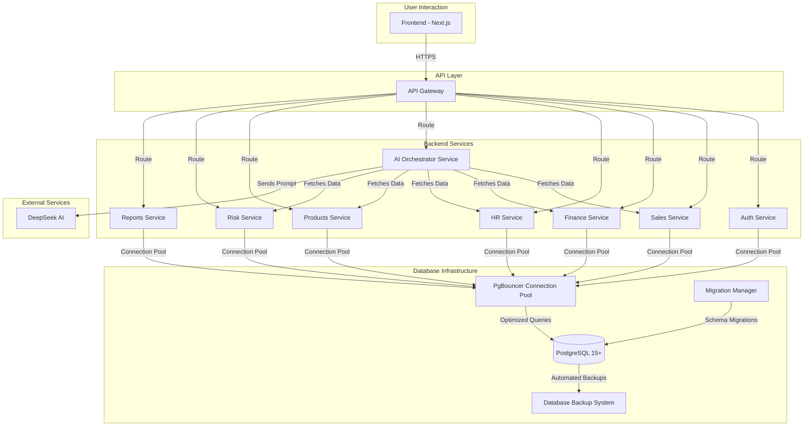
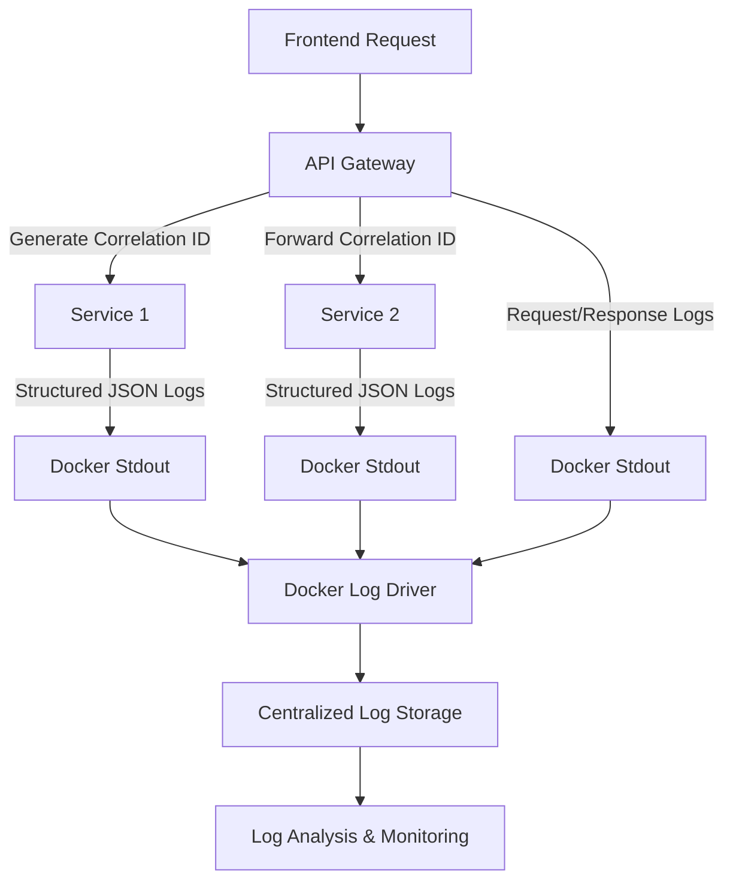
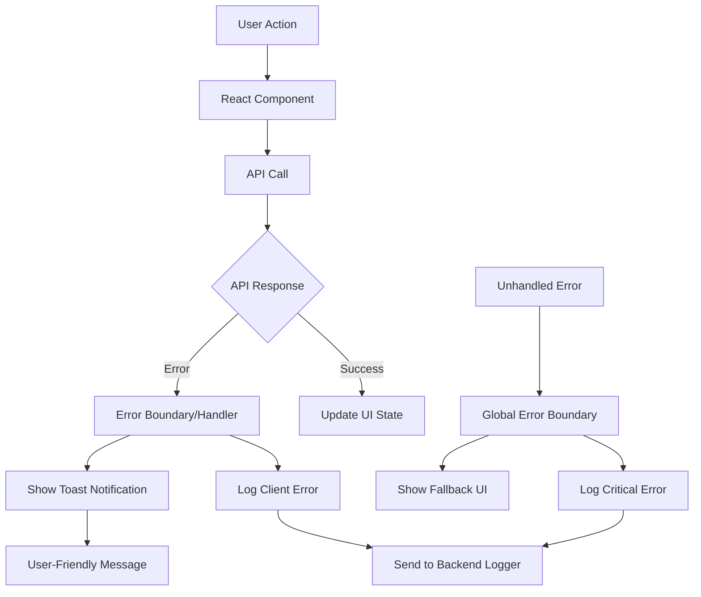

# System Architecture

_Last updated: 14/09/2025_

## 1. Guiding Principles

- **Scalability:** The system must be able to handle growing amounts of data and user traffic.
- **Resilience:** The failure of one component should not bring down the entire system.
- **Maintainability:** Services should be independently deployable and easy to understand.
- **Security:** Data must be protected at rest and in transit.

## 2. High-Level Architecture

A-EMS will be built on a **Microservices Architecture**. This choice provides separation of concerns, allows for independent scaling of services, and enables technology diversity if needed in the future. The entire system will be containerized with **Docker** and orchestrated via **Docker Compose** for development and initial deployment.



### Components:

1.  **Frontend (Next.js):** A single-page application (SPA) that serves as the user's entry point. It is responsible for rendering the UI, managing user state, and communicating with the backend via a central API Gateway.
2.  **API Gateway:** A single entry point for all client requests. It routes traffic to the appropriate microservice and handles cross-cutting concerns like authentication and rate limiting.
3.  **Backend Microservices (Python/FastAPI):**
    - **Enhanced Auth Service:** Manages comprehensive user identity, authentication, and authorization including:
      - JWT-based authentication with refresh tokens
      - Multi-Factor Authentication (MFA) with TOTP and backup codes
      - OAuth 2.0 / OIDC integration with Google
      - Password management (change, reset, forgot password)
      - Role-based access control (RBAC)
      - Session management and token validation
      - User provisioning and account lifecycle management
    - **Sales Service:** Comprehensive sales data management including pipeline, forecasting, customer analytics, and territory performance.
    - **Finance Service:** Complete financial management including KPIs, cash flow, budgeting, expense tracking, revenue recognition, and profitability analysis.
    - **HR Service:** Full HR analytics covering headcount, recruitment, performance management, compensation, engagement, and training metrics.
    - **Products Service:** Complete product management including inventory tracking, product analytics, lifecycle management, catalog management, and demand forecasting.
    - **Risk Management Service:** Enterprise risk assessment including compliance monitoring, incident management, regulatory reporting, and risk analytics with early warning systems.
    - **Reports Service:** Comprehensive reporting capabilities including custom report generation, scheduling, export functionality, and real-time dashboard visualization from multiple data sources.
    - **AI Orchestrator Service:** Advanced AI interaction management with comprehensive features including:
      - **Multi-turn Conversations:** Context-aware chat sessions with memory persistence
      - **Session Management:** Conversation history tracking and context preservation
      - **Smart Context Aggregation:** Intelligent data gathering from multiple business services
      - **Response Optimization:** Chart generation, insights extraction, and recommendation engines
      - **User Feedback Loop:** Quality improvement through rating and feedback collection
      - **Contextual Suggestions:** Proactive query recommendations based on user role and history
      - **Real-time Streaming:** Optional SSE-based streaming for enhanced user experience
      - **Analytics & Monitoring:** Usage patterns, performance metrics, and quality analytics
      - **DeepSeek Integration:** Advanced prompt engineering and response processing
4.  **PostgreSQL Database Infrastructure:** A comprehensive, enterprise-grade database system designed for microservices architecture:
    - **Database-per-Service Pattern:** Each microservice domain has dedicated schemas while sharing core authentication and tenant data
    - **Containerized Deployment:** PostgreSQL 15+ running in Docker containers with PgBouncer connection pooling
    - **Multi-Tenant Architecture:** Tenant-scoped data isolation with row-level security policies
    - **Advanced Analytics Support:** Optimized schema design for AI/ML workloads and real-time business intelligence
    - **Performance Optimization:** Strategic indexing, partitioning for time-series data, and materialized views for complex queries
    - **Security & Compliance:** Data encryption at rest/transit, comprehensive audit logging, and GDPR compliance features
    - **Backup & Recovery:** Automated backup systems with point-in-time recovery capabilities
5.  **DeepSeek AI:** An external, third-party service that provides the core natural language processing and generation capabilities.

## 3. Data Flow

### Example 1: Enhanced User Authentication Flow

#### Standard Login

1.  User enters credentials in the **Frontend**.
2.  Frontend sends a request to the **API Gateway**, which routes it to the **Auth Service**.
3.  **Auth Service** validates credentials against the **PostgreSQL Database**.
4.  If MFA is enabled, **Auth Service** returns an MFA challenge requiring TOTP code.
5.  User provides TOTP code, **Auth Service** validates it.
6.  On success, it generates a JSON Web Token (JWT) and refresh token, returns them to the user.
7.  The **Frontend** stores the JWT for subsequent authenticated requests.

#### OAuth 2.0 Google Login

1.  User clicks "Login with Google" in the **Frontend**.
2.  Frontend redirects to Google OAuth authorization server.
3.  User authenticates with Google and grants permissions.
4.  Google redirects back to **Frontend** with authorization code.
5.  Frontend sends authorization code to **Auth Service** via **API Gateway**.
6.  **Auth Service** exchanges code for Google access token and user info.
7.  **Auth Service** either creates new user or links to existing account.
8.  **Auth Service** generates JWT and returns user session data.

#### MFA Setup Flow

1.  User navigates to MFA settings in **Frontend**.
2.  Frontend requests TOTP setup from **Auth Service**.
3.  **Auth Service** generates secret key and QR code, returns to **Frontend**.
4.  User scans QR code with authenticator app and enters verification code.
5.  **Auth Service** validates TOTP code and enables MFA for user.
6.  **Auth Service** generates backup codes and returns them securely.

#### Administrative User Registration

1.  Administrator accesses user management interface in **Frontend**.
2.  Administrator fills out new user form with role and permissions.
3.  Frontend sends registration request to **Auth Service** via **API Gateway**.
4.  **Auth Service** validates administrator permissions and creates user account.
5.  **Auth Service** sends welcome email with temporary password to new user.
6.  New user must change password and setup MFA on first login.

### Example 2: Enhanced AI Chat Interaction Flow

#### Multi-turn Conversation with Context

1.  User types "Compare our sales in Q1 vs Q2" into the chat interface on the **Frontend**.
2.  Frontend sends the authenticated request (with JWT and session_id) to the **API Gateway**, which routes it to the **AI Orchestrator Service**.
3.  **AI Orchestrator Service** performs intelligent context gathering:

- Retrieves conversation history for session continuity
- Calls **Sales Service** via API Gateway to fetch Q1 and Q2 sales data
- Calls **Finance Service** for related financial context
- Aggregates user permissions to determine data access scope

4.  **AI Orchestrator Service** constructs comprehensive prompt with business context and sends to **DeepSeek AI**.
5.  **DeepSeek AI** processes the request and returns structured analysis with recommendations.
6.  **AI Orchestrator Service** processes the response:

- Generates chart data specifications for frontend rendering
- Extracts key insights and recommendations
- Creates contextual follow-up suggestions
- Stores conversation in session history

7.  Enhanced response is returned to **Frontend** including:

- Natural language analysis
- Chart visualization data
- Key insights and recommendations
- Suggested follow-up questions

8.  **Frontend** renders the complete response with interactive visualizations.

#### Context Management and Follow-up

9.  User asks follow-up question: "What drove the increase in Q2?"
10. **AI Orchestrator Service** maintains context from previous exchange:
    - References previous Q1/Q2 comparison
    - Accesses deeper sales and market data
    - Provides contextual analysis without requiring context restatement

### Example 3: Password Change Flow

1.  User navigates to account settings in **Frontend**.
2.  User enters current password and new password in form.
3.  Frontend sends password change request to **Auth Service** via **API Gateway**.
4.  **Auth Service** validates current password and enforces password policy.
5.  **Auth Service** updates password hash in **PostgreSQL Database**.
6.  **Auth Service** invalidates all existing sessions except current one.
7.  **Auth Service** sends password change confirmation email to user.

## 4. Database Architecture & Design

### 4.1. Database Architecture Overview

The A-EMS database architecture follows a **Database-per-Service** pattern with shared core entities, optimized for microservices while maintaining data consistency and supporting advanced AI analytics:

```mermaid
graph TB
    subgraph "Core Shared Database"
        A[tenants - Multi-tenancy Support]
        B[users - Authentication & Identity]
        C[user_sessions - JWT & Session Management]
        D[user_mfa - Multi-Factor Authentication]
        E[oauth_connections - OAuth Integration]
    end

    subgraph "Sales Domain"
        F[sales_metrics - KPIs & Performance]
        G[customers - CRM Data]
        H[sales_pipeline - Opportunity Tracking]
    end

    subgraph "Finance Domain"
        I[finance_metrics - Financial KPIs]
        J[budget_plans - Budget Management]
        K[expense_transactions - Expense Tracking]
    end

    subgraph "HR Domain"
        L[hr_metrics - Workforce Analytics]
        M[employees - Employee Management]
        N[recruitment_pipeline - Hiring Process]
    end

    subgraph "Products Domain"
        O[products - Product Catalog]
        P[inventory_levels - Stock Management]
        Q[product_performance - Analytics]
    end

    subgraph "Risk & Compliance Domain"
        R[risk_assessments - Risk Management]
        S[compliance_records - Compliance Tracking]
        T[audit_logs - Comprehensive Audit Trail]
    end

    A -.->|tenant_id| F
    A -.->|tenant_id| I
    A -.->|tenant_id| L
    A -.->|tenant_id| O
    A -.->|tenant_id| R

    B -.->|user_id| F
    B -.->|user_id| I
    B -.->|user_id| L
    B -.->|created_by/updated_by| T

    M -.->|employee_id| R
    G -.->|customer_id| H
    O -.->|product_id| P
    O -.->|product_id| Q
```



### 4.2. Database Technology Stack

- **Database Engine**: PostgreSQL 15+ (Alpine Linux container)
- **Connection Pooling**: PgBouncer for optimal connection management
- **Character Encoding**: UTF-8 with en_US.UTF-8 collation
- **Extensions**: uuid-ossp, pgcrypto, pg_stat_statements, btree_gin, pg_trgm
- **Deployment**: Docker containerized with persistent volumes

### 4.3. Data Design Principles

1. **Multi-Tenant Ready**: All business entities include `tenant_id` for enterprise deployment scalability
2. **Audit Trail Compliance**: Comprehensive audit fields (`created_at`, `updated_at`, `created_by`, `updated_by`, `deleted_at`)
3. **Soft Delete Pattern**: Critical business data uses timestamp-based soft deletes for data integrity
4. **AI/ML Optimization**: Schema designed to support machine learning model training and real-time analytics
5. **Performance First**: Strategic indexing, partitioning for time-series data, and materialized views for complex queries
6. **Security by Design**: Row-level security policies, data encryption, and comprehensive access controls

### 4.4. Database Performance Architecture

#### Indexing Strategy

```sql
-- Performance-critical indexes
CREATE INDEX CONCURRENTLY idx_users_email_active ON users(email) WHERE deleted_at IS NULL;
CREATE INDEX CONCURRENTLY idx_sales_metrics_tenant_date ON sales_metrics(tenant_id, metric_date DESC);
CREATE INDEX CONCURRENTLY idx_customers_tenant_segment ON customers(tenant_id, customer_segment);
CREATE INDEX CONCURRENTLY idx_audit_logs_tenant_time ON audit_logs(tenant_id, timestamp DESC);

-- Full-text search support
CREATE INDEX CONCURRENTLY idx_customers_search ON customers USING gin(to_tsvector('english', company_name));
CREATE INDEX CONCURRENTLY idx_products_search ON products USING gin(to_tsvector('english', name || ' ' || description));
```

#### Partitioning for Scale

- **Time-Series Partitioning**: `audit_logs` table partitioned by month for optimal performance
- **Tenant-Based Partitioning**: Large tables can be partitioned by `tenant_id` for enterprise deployments
- **Automated Partition Management**: Database functions automatically create future partitions

### 4.5. Database Security Architecture

#### Row-Level Security (RLS)

```sql
-- Tenant isolation at database level
ALTER TABLE customers ENABLE ROW LEVEL SECURITY;
CREATE POLICY tenant_isolation_policy ON customers
    FOR ALL TO application_user
    USING (tenant_id = current_setting('app.current_tenant_id')::UUID);
```

#### Data Encryption

- **At-Rest Encryption**: PostgreSQL transparent data encryption (TDE)
- **In-Transit Encryption**: SSL/TLS for all database connections
- **Application-Level Encryption**: Sensitive fields (salary, MFA secrets) encrypted using pgcrypto

#### Backup & Recovery Strategy

- **Automated Backups**: Daily pg_dump with 30-day retention
- **Point-in-Time Recovery**: WAL archiving for recovery to any point in time
- **Cross-Region Replication**: Production setup includes read replicas for disaster recovery

For detailed database schema specifications, see [Database Schema](./Database_Schema.md).

## 5. Infrastructure & Deployment

- **Containerization:** All services (frontend, backend microservices, database) will be packaged as **Docker** containers. This is defined in `Dockerfile`s within each service's directory.
- **Orchestration:** `docker-compose.yml` in the `infra/` directory will define and link all the services, allowing the entire application stack to be brought up or down with a single command (`docker-compose up`).
- **Environment:** This setup is ideal for local development and can be adapted for deployment to cloud platforms like AWS (ECS/EKS), Google Cloud (GKE), or Azure (AKS) using their respective container orchestration services.

## 5. Infrastructure & Deployment

- **Containerization:** All services (frontend, backend microservices, database infrastructure) will be packaged as **Docker** containers. This is defined in `Dockerfile`s within each service's directory.
- **Database Orchestration:** PostgreSQL and PgBouncer containers with persistent volume management, health checks, and automated backup systems
- **Service Orchestration:** `docker-compose.yml` in the `infra/` directory will define and link all the services, including database infrastructure, allowing the entire application stack to be brought up or down with a single command (`docker-compose up`)
- **Environment Management:** Separate configurations for development, staging, and production environments with appropriate resource allocation and security settings
- **Database Migration System:** Automated migration management with version control and rollback capabilities
- **Monitoring & Health Checks:** Comprehensive health monitoring for database performance, connection pooling, and query optimization
- **Environment:** This setup is ideal for local development and can be adapted for deployment to cloud platforms like AWS (ECS/EKS), Google Cloud (GKE), or Azure (AKS) using their respective container orchestration services.

## 6. Logging Architecture & Flow

### 6.1. Logging Principles

The A-EMS system implements comprehensive logging across all components following these principles:

- **Structured Logging**: All logs use JSON format for machine readability and consistent parsing
- **Correlation IDs**: Every request is tracked with unique identifiers across all services
- **Centralized Collection**: Docker logging drivers aggregate logs from all containers
- **Security**: No sensitive data (PII, passwords, tokens) in logs

### 6.2. Backend Logging Flow



**Log Flow Process:**

1. **Request Initiation**: Frontend sends request with optional correlation ID
2. **Gateway Processing**: API Gateway generates or forwards correlation ID, logs request details
3. **Service Processing**: Each microservice logs operations with correlation ID context
4. **Container Logging**: All logs output to stdout/stderr (captured by Docker)
5. **Log Aggregation**: Docker logging driver collects and formats logs
6. **Storage & Monitoring**: Logs stored for analysis and real-time monitoring

### 6.3. Frontend Error Handling Flow



**Frontend Error Types & Responses:**

- **401 Unauthorized**: Redirect to login with session expired message
- **403 Forbidden**: Warning toast with permission denied message
- **422 Validation**: Contextual error toast with specific field issues
- **500 Server Error**: Generic error toast with "try again later" message
- **Network Error**: Connectivity issue notification

### 6.4. Monitoring & Observability

**Key Metrics Tracked:**

- **Request Tracing**: End-to-end request flow with correlation IDs
- **Performance Monitoring**: Response times, database query performance
- **Error Rates**: Service-level error frequencies and patterns
- **Security Events**: Authentication failures, suspicious activities
- **Business Metrics**: User actions, feature usage analytics

**Log Categories:**

- **Application Logs**: Business logic, user actions, system operations
- **Security Logs**: Authentication, authorization, security events
- **Performance Logs**: Response times, resource usage, bottlenecks
- **Audit Logs**: Data access, configuration changes, admin actions

For detailed logging implementation guidelines, see [Logging Guide](./Logging_Guide.md).
