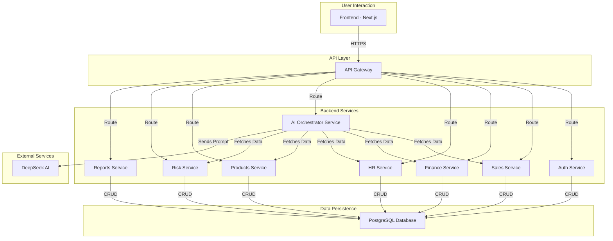

# System Architecture

_Last updated: 14/09/2025_

## 1. Guiding Principles

- **Scalability:** The system must be able to handle growing amounts of data and user traffic.
- **Resilience:** The failure of one component should not bring down the entire system.
- **Maintainability:** Services should be independently deployable and easy to understand.
- **Security:** Data must be protected at rest and in transit.

## 2. High-Level Architecture

A-EMS will be built on a **Microservices Architecture**. This choice provides separation of concerns, allows for independent scaling of services, and enables technology diversity if needed in the future. The entire system will be containerized with **Docker** and orchestrated via **Docker Compose** for development and initial deployment.

### Components:

1.  **Frontend (Next.js):** A single-page application (SPA) that serves as the user's entry point. It is responsible for rendering the UI, managing user state, and communicating with the backend via a central API Gateway.
2.  **API Gateway:** A single entry point for all client requests. It routes traffic to the appropriate microservice and handles cross-cutting concerns like authentication and rate limiting.
3.  **Backend Microservices (Python/FastAPI):**
    - **Enhanced Auth Service:** Manages comprehensive user identity, authentication, and authorization including:
      - JWT-based authentication with refresh tokens
      - Multi-Factor Authentication (MFA) with TOTP and backup codes
      - OAuth 2.0 / OIDC integration with Google
      - Password management (change, reset, forgot password)
      - Role-based access control (RBAC)
      - Session management and token validation
      - User provisioning and account lifecycle management
    - **Sales Service:** Comprehensive sales data management including pipeline, forecasting, customer analytics, and territory performance.
    - **Finance Service:** Complete financial management including KPIs, cash flow, budgeting, expense tracking, revenue recognition, and profitability analysis.
    - **HR Service:** Full HR analytics covering headcount, recruitment, performance management, compensation, engagement, and training metrics.
    - **Products Service:** Complete product management including inventory tracking, product analytics, lifecycle management, catalog management, and demand forecasting.
    - **Risk Management Service:** Enterprise risk assessment including compliance monitoring, incident management, regulatory reporting, and risk analytics with early warning systems.
    - **Reports Service:** Comprehensive reporting capabilities including custom report generation, scheduling, export functionality, and real-time dashboard visualization from multiple data sources.
    - **AI Orchestrator Service:** Acts as a bridge between the user's query and the DeepSeek AI model. It fetches context from other services and performs intelligent data aggregation before querying the AI.
4.  **PostgreSQL Database:** The primary relational database. While shown as a single instance for simplicity, in a true microservice architecture, each service might have its own dedicated database or schema.
5.  **DeepSeek AI:** An external, third-party service that provides the core natural language processing and generation capabilities.

## 3. Data Flow

### Example 1: Enhanced User Authentication Flow

#### Standard Login

1.  User enters credentials in the **Frontend**.
2.  Frontend sends a request to the **API Gateway**, which routes it to the **Auth Service**.
3.  **Auth Service** validates credentials against the **PostgreSQL Database**.
4.  If MFA is enabled, **Auth Service** returns an MFA challenge requiring TOTP code.
5.  User provides TOTP code, **Auth Service** validates it.
6.  On success, it generates a JSON Web Token (JWT) and refresh token, returns them to the user.
7.  The **Frontend** stores the JWT for subsequent authenticated requests.

#### OAuth 2.0 Google Login

1.  User clicks "Login with Google" in the **Frontend**.
2.  Frontend redirects to Google OAuth authorization server.
3.  User authenticates with Google and grants permissions.
4.  Google redirects back to **Frontend** with authorization code.
5.  Frontend sends authorization code to **Auth Service** via **API Gateway**.
6.  **Auth Service** exchanges code for Google access token and user info.
7.  **Auth Service** either creates new user or links to existing account.
8.  **Auth Service** generates JWT and returns user session data.

#### MFA Setup Flow

1.  User navigates to MFA settings in **Frontend**.
2.  Frontend requests TOTP setup from **Auth Service**.
3.  **Auth Service** generates secret key and QR code, returns to **Frontend**.
4.  User scans QR code with authenticator app and enters verification code.
5.  **Auth Service** validates TOTP code and enables MFA for user.
6.  **Auth Service** generates backup codes and returns them securely.

#### Administrative User Registration

1.  Administrator accesses user management interface in **Frontend**.
2.  Administrator fills out new user form with role and permissions.
3.  Frontend sends registration request to **Auth Service** via **API Gateway**.
4.  **Auth Service** validates administrator permissions and creates user account.
5.  **Auth Service** sends welcome email with temporary password to new user.
6.  New user must change password and setup MFA on first login.

### Example 2: User Asks the AI a Question

1.  User types "Compare our sales in Q1 vs Q2" into the chat interface on the **Frontend**.
2.  Frontend sends the authenticated request (with JWT) to the **API Gateway**, which routes it to the **AI Orchestrator Service**.
3.  The **AI Orchestrator Service** calls the **Sales Service** via the API Gateway to fetch sales data for Q1 and Q2.
4.  It then constructs a detailed prompt (e.g., "Given the following sales data [...], compare Q1 and Q2.").
5.  The prompt is sent to the external **DeepSeek AI API**.
6.  DeepSeek processes the request and returns a natural language answer with analysis.
7.  The **AI Orchestrator Service** forwards the answer back to the **Frontend**, which displays it to the user.

### Example 3: Password Change Flow

1.  User navigates to account settings in **Frontend**.
2.  User enters current password and new password in form.
3.  Frontend sends password change request to **Auth Service** via **API Gateway**.
4.  **Auth Service** validates current password and enforces password policy.
5.  **Auth Service** updates password hash in **PostgreSQL Database**.
6.  **Auth Service** invalidates all existing sessions except current one.
7.  **Auth Service** sends password change confirmation email to user.

## 4. Infrastructure & Deployment

- **Containerization:** All services (frontend, backend microservices, database) will be packaged as **Docker** containers. This is defined in `Dockerfile`s within each service's directory.
- **Orchestration:** `docker-compose.yml` in the `infra/` directory will define and link all the services, allowing the entire application stack to be brought up or down with a single command (`docker-compose up`).
- **Environment:** This setup is ideal for local development and can be adapted for deployment to cloud platforms like AWS (ECS/EKS), Google Cloud (GKE), or Azure (AKS) using their respective container orchestration services.
